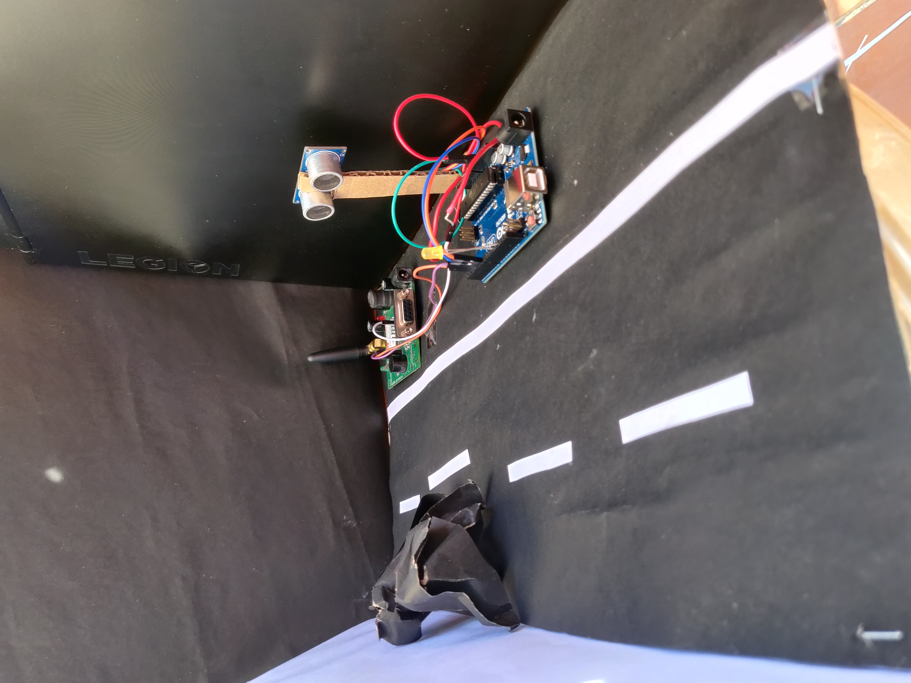

# **Landslide Monitoring System**

## **Problem Statement**

During monsoon season the road connectivity in hilly areas is a major problem. Due to heavy rainfall, complete washout of roads takes place up to 50 m length, land slide in many locations disturbs the flow of traffic. We can undoubtly say that natural calamity and extreme weather incidents is a matter of concern. Restoring of connectivity in the shortest possible duration is required so that small vehicles and regular traffic flow can be resumed. But the major problem arises in situations where there is a complete washout of trenches and there is no way for traffic to flow either side, wherein the only solution is spontaneous arrival of Rescue team and PWD department to clear the roads as soon as possible. 

For this use case we suggest our idea of Landslide Monitoring System. An Iot Based system which fetches real time data soil moisture content and warns for any calamity that may occour is any reading goes beyond the threshold.

Not only this if unfortunately landslide takes places, the system sends a spontaneous alert to the PWD department and nearest check post to stop the traffic before hand and clear the way for arrival of resure vehicles.

## **Hardware Used**
* Ultrasonic Sensor
* GSM Module
* Arduino UNO
* Accelerometer 
* Soil Moisture Sensor

## **Work Flow**
The project contains code for sending alert through the GSM module to the conserned authorities in case landslide has taken palce. The obstruction is detected by the Ultrasonic sensor which tiggers the alerts.

Idea Description: 
1. Using soil moisture sensing module to sense the loosening of soil
2. Using accelerometer to sense the motion of rocks
3. Using ultrasonic sensors to detect the landslide
4. Using GSM module to send SMS alerts

## **Video**
A sample working of the prototype can be seen:

<video src='Media1.mp4' width=180>

